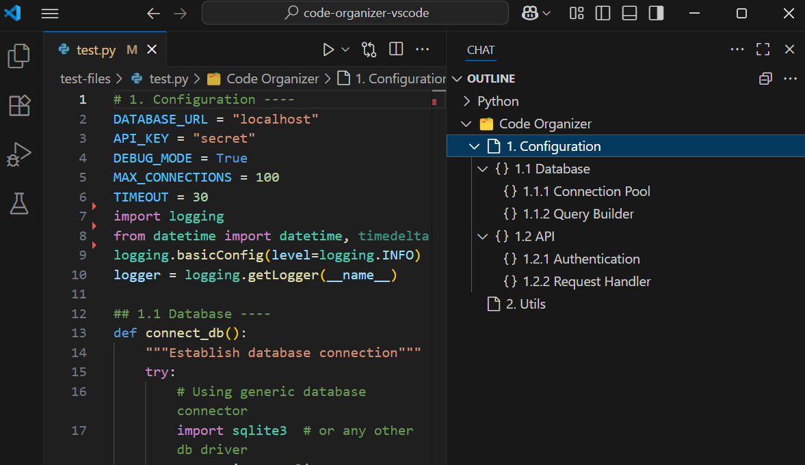
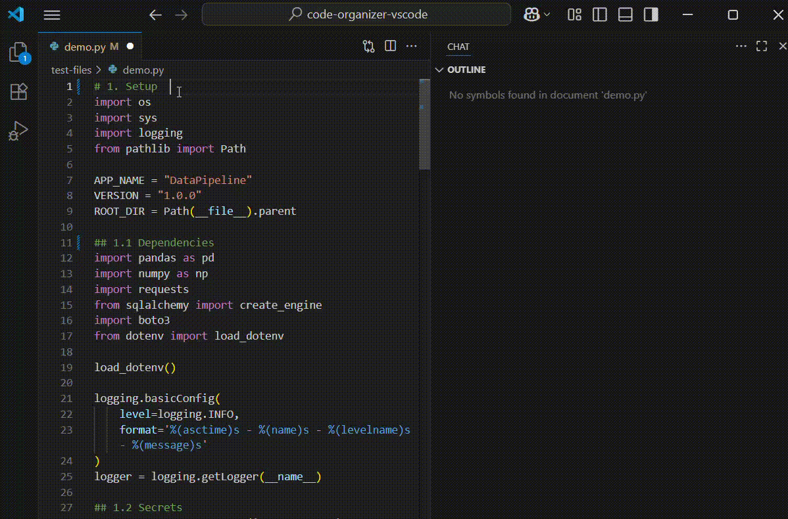

# Code Organizer

<p align="center">
  
</p>

<p align="center">
  <strong>Code section navigation for VS Code</strong><br>
  Organize and navigate large files with simple comment patterns
</p>


## Features

Transform your code files into organized, navigable documents with a table of contents-like structure. Create sections using simple comments, then use VS Code's built-in Outline panel to view and instantly jump to any section with a single click.

- **Simple syntax**: `# Section Name ----`
- **Table of contents experience**: Comments become navigable outline entries
- **Hierarchical nesting**: `##`, `###`, `####` for multi-level organization
- **Multi-language support**: Works with any comment style
- **Lightweight & fast**: Only responds to simple comments, no complex parsing
- **VS Code integration**: Seamless outline view, breadcrumbs, and Go to Symbol
- **Zero configuration**: Works immediately
  



## Quick Start

**To use:**
1. Install the extension
2. Add comment sections ending with `----` (4 or more dashes) to trigger code organization
3. Check the **Outline** panel in VS Code's Explorer sidebar
4. Click any section to jump to it instantly




## Language Support & Examples

| Language | Example | Nesting |
|----------|---------|---------|
| Python, R, Shell | `# Section ----` | `##`, `###`, `####` |
| JavaScript, TypeScript, C++, Java, Go, Rust | `// Section ----` | `////`, `//////`, `////////` |
| SQL, PostgreSQL | `-- Section ----` | `----`, `------`, `--------` |

**Works with:** Python • JavaScript • TypeScript • Java • C# • C++ • Go • Rust • Swift • PHP • SQL • R • Shell • and more...

### Python Example


```python
# 1. Configuration ----
DATABASE_URL = "localhost"
API_KEY = "secret"

## 1.1 Database Settings ----
def connect():
    return db.connect(DATABASE_URL)

### 1.1.1 Connection Pool ----
def create_pool():
    return ConnectionPool()

## 1.2 API Settings ----
def setup_api():
    return API(API_KEY)

# 2. Main Application ----
def run():
    db = connect()
    api = setup_api()
```

### JavaScript Example

```javascript
// 1. App Configuration ----
const config = {
    apiUrl: 'https://api.example.com',
    timeout: 5000
};

//// 1.1 Helper Functions ----
function getData() {
    return fetch(config.apiUrl);
}

function processData(data) {
    return data.map(item => item.value);
}

// 2. Main Application ----
class App {
    constructor() {
        this.data = [];
    }
    
    //// 2.1 Event Handlers ----
    handleClick(event) {
        console.log('Clicked:', event.target);
    }
}
```

### SQL Example

```sql
-- 1. Database Setup ----
CREATE DATABASE myapp;
USE myapp;

---- 1.1 Tables ----
CREATE TABLE users (
    id INT PRIMARY KEY,
    name VARCHAR(100),
    email VARCHAR(255)
);

------ 1.1.1 Indexes ----
CREATE INDEX idx_user_email ON users(email);

---- 1.2 Stored Procedures ----
DELIMITER $$
CREATE PROCEDURE GetUser(IN user_id INT)
BEGIN
    SELECT * FROM users WHERE id = user_id;
END$$
DELIMITER ;

-- 2. Sample Data ----
INSERT INTO users VALUES (1, 'John Doe', 'john@example.com');
```

## Why Use This Extension?

### The Problem
- **Large files are hard to navigate** - scrolling through 1000+ line files
- **VS Code's outline only shows functions/classes** - not logical code sections
- **No consistent organization** across different programming languages
- **Lost context** when jumping between different parts of complex files

### Our Solution
Simple, universal comment patterns that work everywhere with instant VS Code integration.

Perfect for polyglot developers working across multiple programming languages.

### Comparison with Alternatives

| Feature | **Code Organizer** | Bookmarks | Better Comments | Region Folding |
|---------|----------------------------|-----------|-----------------|----------------|
| Automatic structure detection | ✅ | ❌ | ❌ | ❌ |
| Hierarchical organization | ✅ | ❌ | ❌ | ⚠️ |
| Multi-language support | ✅ | ✅ | ✅ | ⚠️ |
| Outline integration | ✅ | ❌ | ❌ | ❌ |
| Zero configuration | ✅ | ❌ | ❌ | ❌ |
| Comment-based | ✅ | ❌ | ✅ | ⚠️ |

## Installation

**VS Code Marketplace:** Open Extensions (Ctrl+Shift+X) → Search "Code Organizer" → Install

**Command Line:**
```bash
code --install-extension ran-codes.code-organizer-vscode
```

---

## Release Notes

See [CHANGELOG.md](CHANGELOG.md) for detailed release information.

### 0.0.1 - Initial Release
- Support for `#`, `//`, and `--` comment styles
- Hierarchical section nesting up to 4 levels
- VS Code outline integration
- Multi-language support
- Zero configuration setup

## License

MIT License - see [LICENSE](LICENSE) file for details.

---

<p align="center">
  <em>Inspired by RStudio's Code Sections • Built with ❤️ for the VS Code community</em>
</p>
